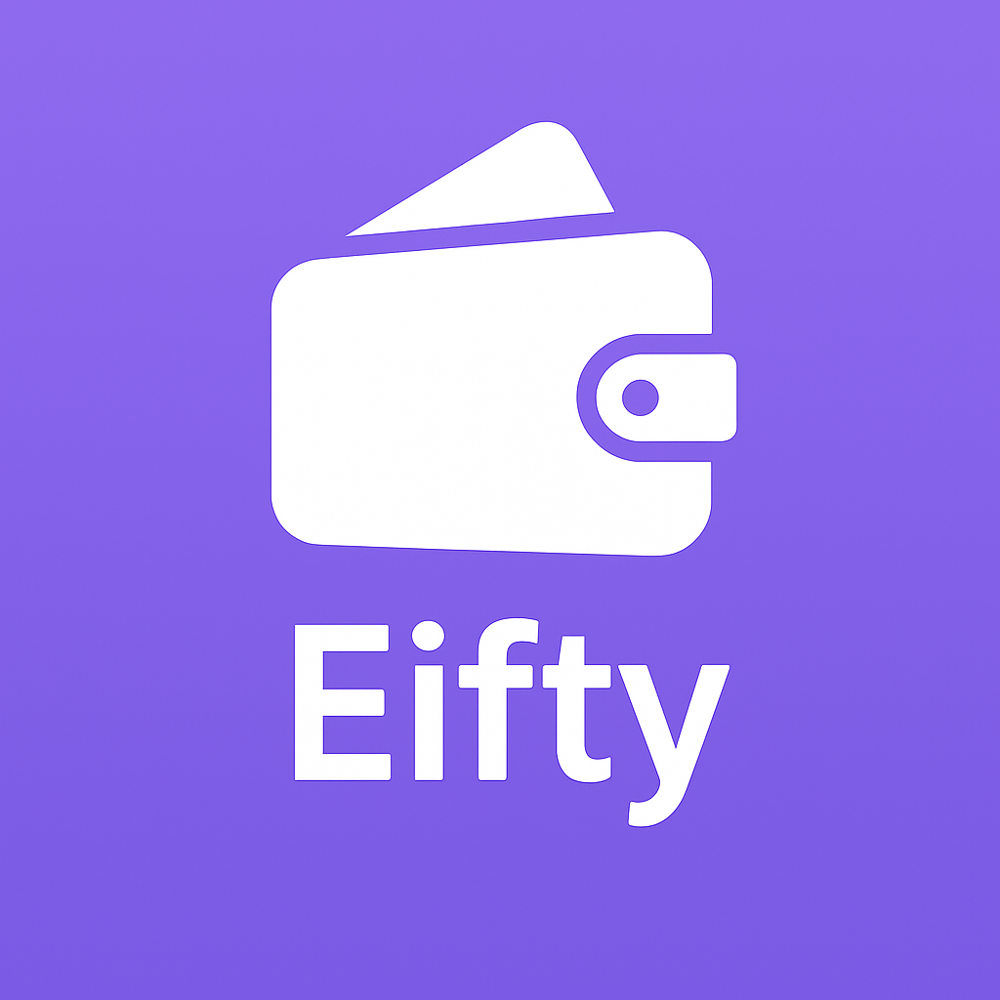

## 1. 📌 프로젝트 개요

### 🔹 프로젝트명
<table>
  <tr>
    <td width="80">
      
    </td>
    <td>
      <h2><b>Eifty</b> - 간편하고 안전한 전자지갑 앱</h2>
    </td>
  </tr>
</table>

### 🔹 개발 기간
2025년 3월 ~ 2025년 6월

### 🔹 개발 배경
블록체인과 디지털 자산의 확산에 따라, 사용자들이 쉽게 디지털 자산을 보관하고 관리할 수 있는 전자지갑의 필요성이 증가하고 있습니다. 그러나 기존 지갑 앱은 초보 사용자에게 진입장벽이 높고, 사용성 면에서 아쉬운 점이 많았습니다.

**Eifty**는 다음과 같은 문제의식을 바탕으로 기획되었습니다:

- 니모닉 기반 지갑 생성/복구의 불편함  
- 지갑 주소 관리 및 전송 흐름의 복잡성  
- 실시간 자산/트랜잭션 정보에 대한 가시성 부족  
- 테스트 환경에서의 Web3 연습 어려움  

### 🔹 개발 목표
초보자도 쉽게 사용할 수 있는 전자지갑 앱을 Flutter 기반으로 구현하여 다음을 달성하는 것:

- **간편한 지갑 생성 및 복구**
- **직관적인 자산 및 거래 관리 인터페이스**
- **Polygon Amoy Testnet을 이용한 실전형 Web3 학습 환경**
- **QR 기반 주소 송수신 기능으로 사용자 경험 향상**

### 🔹 주요 기능 요약
- 니모닉 기반 다중 지갑 생성 및 복구  
- 실시간 잔액 및 트랜잭션 내역 조회  
- QR 기반 주소 공유 및 송금 흐름  
- 테스트넷 환경에서 안전한 이더리움 기반 송금 기능 제공  

### 🔹 전체 아키텍처 요약
```
[Flutter Frontend]
│
├── web3dart (Polygon Amoy Testnet RPC 직접 호출)
├── CoinGecko API (환율 정보)
└── Polygonscan API (트랜잭션 정보)
```

---

## 2. 👥 팀 구성 및 담당 역할

### 🔸 팀원별 주요 담당 기능

| 프로필 | 이름 (GitHub) | 주요 담당 기능 | 세부 내용 |
|--------|----------------|----------------|-----------|
|  | 김문원 ([angkmfirefoxygal](https://github.com/angkmfirefoxygal)) | **트랜잭션 송/수신 로직 및 UI 구현** | - 수신자 선택, 금액 입력, 전송 확인 3단계 UI 흐름 설계 및 구현<br>- `web3dart` 기반 Polygon Amoy 테스트넷 트랜잭션 실행 로직 구현 |
|  | 하고은 ([hagoeun0119](https://github.com/hagoeun0119)) | **지갑 잔액 조회 및 표시** | - 선택된 지갑 주소의 잔액을 RPC를 통해 실시간으로 조회<br>- CoinGecko API 연동을 통한 자산의 USD 환산 표시 기능 구현 |
|  | 전시원 ([siiion](https://github.com/siiion)) | **지갑 생성 및 복구**, **지갑 리스트 관리**, **트랜잭션 내역 UI 구성** | - 니모닉 기반 지갑 생성/복구 흐름 구현<br>- 생성된 지갑들을 리스트로 관리하는 기능<br>- Polygonscan API를 통해 가져온 트랜잭션 내역 UI 구성 |

---

## 3. 🧩 기능 요약

### ✅ 전체 기능 흐름 요약

사용자는 앱에서 다음과 같은 주요 기능을 수행할 수 있습니다:

1. **지갑 생성 및 복구**
2. **다중 지갑 관리**
3. **실시간 잔액 및 자산 가치 확인**
4. **최근 트랜잭션 내역 조회**
5. **QR 코드 기반 송금 및 수신**
6. **Polygon Amoy Testnet 상의 안전한 토큰 송금**

### 1️⃣ 지갑 생성 및 복구

- **니모닉 기반 지갑 생성**
  - 사용자가 앱에서 지갑 이름을 입력하면 12단어 니모닉이 자동 생성됨
  - 확인 절차를 통해 백업 유도를 위한 니모닉 검증 단계 포함
  - 최종적으로 생성된 지갑의 주소 및 이름을 확인

- **기존 니모닉을 통한 지갑 복구**
  - 사용자가 보관 중인 12개 단어 입력
  - 유효한 경우 기존 지갑 주소를 복구해 지갑 리스트에 추가

### 2️⃣ 다중 지갑 관리

- 여러 개의 지갑 생성/복구 가능
- 리스트 형태로 모든 지갑 정보를 관리
- 선택된 지갑이 "기본 지갑"으로 설정되어 홈 화면에 반영됨

### 3️⃣ 지갑 잔액 및 USD 환산 표시

- 선택한 지갑 주소의 **MATIC 잔액**을 실시간 조회
  - Polygon Amoy Testnet RPC를 통해 `getBalance()` 호출
- CoinGecko API를 통해 실시간 USD 환율을 불러와 **총 자산 가치를 환산하여 표시**

### 4️⃣ 트랜잭션 내역 조회

- Polygonscan Amoy API를 통해 **최근 트랜잭션 5~10건** 조회
- 수신/송신 여부는 `from` 필드를 기준으로 판단
- 각 트랜잭션에는 다음 정보 포함:
  - 전송/수신 여부, 상대 주소, 수량, 날짜, 해시

### 5️⃣ QR 코드 기반 송금 및 수신

- **QR 코드 생성**
  - 자신의 지갑 주소를 QR로 생성해 다른 사용자에게 공유 가능
- **QR 코드 스캔**
  - 카메라를 통해 상대 지갑 주소를 스캔하면 자동 입력

### 6️⃣ Polygon Testnet 기반 송금 기능

- **3단계 송금 흐름**
  1. **수신자 선택**: 직접 주소 입력 또는 QR 스캔, 최근 전송 주소 목록 제공  
  2. **이체 금액 입력**: 잔액 확인, 수수료 안내 포함  
  3. **송금 확인**: 최종 요약 화면에서 "보내기" 클릭 시 트랜잭션 실행

- 트랜잭션은 `web3dart`를 사용해 RPC를 통해 직접 전송되며, 성공 여부 및 트랜잭션 해시 반환

### 🧪 테스트 환경

- 사용 네트워크: **Polygon Amoy Testnet**
- Chain ID: `80002`
- 테스트 토큰은 Faucet을 통해 수급하여 송수신 기능 검증 완료

---

## 4. 🖼️ 화면 미리보기

각 기능별 주요 화면을 이미지와 함께 소개합니다. 실제 앱 UI를 기준으로 사용자 흐름에 따라 정렬되어 있습니다.

### 📍 지갑 생성 및 복구

| 니모닉 확인 화면 | 지갑 생성 완료 |
|------------------|----------------|
|  |  |
| 사용자가 생성된 니모닉을 확인하고 직접 입력하여 복구를 검증합니다. | 지갑 생성이 완료되면 지갑 주소와 이름이 표시되며 리스트에 추가됩니다. |

### 📍 지갑 목록 및 홈 화면

| 홈 화면 | 지갑 리스트 |
|-----------|--------------|
|  |  |
| 선택된 지갑의 잔액과 최근 트랜잭션 내역이 요약되어 표시됩니다. | 생성/복구된 지갑들을 한눈에 확인하고 선택할 수 있는 리스트입니다. |

### 📍 송수신 흐름 (3단계)

| 수신자 선택 | 이체 금액 입력 |
|--------------|----------------|
|  |  |
| 직접 입력 또는 QR 스캔으로 수신 주소를 입력합니다. | 토큰 종류를 선택하고 이체 금액을 입력합니다. |

| 송금 확인 | QR 수신 |
|-----------|----------|
|  |  |
| 입력된 내용을 바탕으로 최종 확인 후 송금을 실행합니다. | 내 지갑 주소를 QR 코드로 표시해 쉽게 공유할 수 있습니다. |

### 📍 잔액 및 트랜잭션 내역 조회

| 잔액 및 내역 조회 |
|-------------------|
|  |
| 지갑의 실시간 잔액과 최근 트랜잭션 내역을 한 화면에 확인할 수 있습니다. |

---

## 5. 🔑 핵심 기능 코드 예시

본 프로젝트의 핵심은 사용자가 직접 생성한 지갑으로 Polygon Amoy Testnet에서 실시간으로 토큰을 전송하고, 이를 추적할 수 있는 완전한 Web3 연동 환경을 Flutter 앱으로 구현했다는 점입니다. 주요 기능별 실제 구현 코드를 예시로 소개합니다.

---

### 🧨 1. 트랜잭션 실행 (`TransactionService.sendToken`)

사용자가 입력한 수신자 주소와 금액을 바탕으로 실제 트랜잭션을 전송하며, `web3dart`를 사용해 서명, 수수료 계산, 네트워크 전송을 처리합니다.

```
Future<String> sendToken({
  required String recipientAddress,
  required double amount,
  required String tokenSymbol,
  required String privateKey,
}) async {
  final credentials = EthPrivateKey.fromHex(privateKey);
  final sender = await credentials.extractAddress();

  try {
    final valueInWei = BigInt.from(amount * pow(10, 18));

    final transaction = Transaction(
      from: sender,
      to: EthereumAddress.fromHex(recipientAddress),
      value: EtherAmount.inWei(valueInWei),
      gasPrice: await _ethClient.getGasPrice(),
      maxGas: 21000,
    );

    final txHash = await _ethClient.sendTransaction(
      credentials,
      transaction,
      chainId: _chainId,
    );

    return txHash;
  } catch (e) {
    print('🚨 트랜잭션 에러: $e');
    rethrow;
  }
}
```

트랜잭션 실행은 ViewModel에서 다음과 같이 호출됩니다:

```
Future<bool> sendTransaction() async {
  isLoading = true;
  notifyListeners();

  try {
    final selectedAddress = await SecureStorageService.getSelectedWalletAddress();
    final privateKey = await SecureStorageService.getPrivateKey(selectedAddress!);

    final service = TransactionService();
    await service.init(
      rpcUrl: 'https://rpc-amoy.polygon.technology',
      chainId: 80002,
    );

    final hash = await service.sendToken(
      recipientAddress: recipientAddress!,
      amount: amount!,
      tokenSymbol: selectedToken,
      privateKey: privateKey!,
    );

    transactionHash = hash;
    return true;
  } catch (e) {
    debugPrint('트랜잭션 실패: $e');
    return false;
  } finally {
    isLoading = false;
    notifyListeners();
  }
}
```

### 🪙 2. 지갑 생성 (`generateMnemonic` + `generateWalletFromMnemonic`)

니모닉을 기반으로 새 지갑을 생성하고, 앱 내에 안전하게 저장합니다.

```
/// 니모닉 생성
String generateAndReturnMnemonic() {
  _generatedMnemonic = WalletService.generateMnemonic();
  notifyListeners();
  return _generatedMnemonic!;
}

/// 니모닉 기반 지갑 생성
static Future<Map<String, String>> generateWalletFromMnemonic(String mnemonic) async {
  if (!bip39.validateMnemonic(mnemonic)) {
    throw Exception('유효하지 않은 니모닉입니다.');
  }

  final seed = bip39.mnemonicToSeed(mnemonic);
  final privateKey = seed.sublist(0, 32);
  final hexPrivateKey = hex.encode(privateKey);

  final credentials = EthPrivateKey.fromHex(hexPrivateKey);
  final address = await credentials.extractAddress();

  return {
    'mnemonic': mnemonic,
    'privateKey': hexPrivateKey,
    'address': address.hexEip55,
  };
}
```

### 💰 3. 잔액 조회 + 환율 계산 (`getPolBalance` + CoinGecko API)

선택된 지갑의 MATIC 잔액을 Polygon RPC를 통해 조회하고, CoinGecko API를 사용해 USD 자산 가치를 계산합니다.

```
static Future<double> getPolBalance(String address) async {
  final polClient = Web3Client(
    'https://rpc-amoy.polygon.technology',
    Client(),
  );

  try {
    final ethAddress = EthereumAddress.fromHex(address);
    final balance = await polClient.getBalance(ethAddress);
    return balance.getValueInUnit(EtherUnit.ether);
  } catch (e) {
    print('POL 잔액 조회 에러: $e');
    return 0.0;
  } finally {
    polClient.dispose();
  }
}

Future<double> fetchPrice(String coinId) async {
  final url = Uri.parse(
    'https://api.coingecko.com/api/v3/simple/price?ids=$coinId&vs_currencies=usd',
  );
  final response = await http.get(url);
  if (response.statusCode == 200) {
    final data = json.decode(response.body);
    return (data[coinId]['usd'] ?? 0.0) as double;
  }
  return 0.0;
}

/// 종합 데이터 로드 예시
Future<void> loadWalletData() async {
  address = await SecureStorageService.getSelectedWalletAddress();
  final balance = await TransactionService.getPolBalance(address!);
  final price = await fetchPrice('matic-network');

  setState(() {
    polBalance = balance;
    polPrice = price;
    isLoading = false;
  });
}
```

---

## 6. 🛠️ 빌드 및 실행 매뉴얼

본 프로젝트는 Flutter 기반으로 개발되었으며, Android 및 iOS 모두에서 실행 가능하도록 구성되어 있습니다. Web3 기능은 Polygon Amoy Testnet을 기반으로 작동하며, RPC 및 외부 API 설정이 필요합니다.

### 📦 의존성 설치

```bash
flutter clean
flutter pub get
```

### 📱 Android 실행

```
flutter run
# 또는
flutter build apk --release
```

APK 파일 위치:

```
build/app/outputs/flutter-apk/app-release.apk
```

### 🍎 iOS 실행 (Mac + Xcode 환경)

```
cd ios
pod install
open Runner.xcworkspace
```

Xcode에서 `Signing & Capabilities` 설정 후:

```
flutter run
```

### 🌐 Web3 연동 설정

- 사용 네트워크: Polygon Amoy Testnet
- RPC URL: https://rpc-amoy.polygon.technology
- Chain ID: 80002
- 트랜잭션 실행, 잔액 조회 시 해당 RPC를 통해 통신
- 트랜잭션 실행 전 Polygon Amoy Faucet을 통해 테스트 토큰(MATIC) 수령 필요

### 🔐 로컬 보안 저장소 (지갑 정보)

- 지갑 정보(`address`, `privateKey`)는 `flutter_secure_storage`에 저장됨
- 선택된 지갑 정보는 `shared_preferences`로 관리됨

### 📊 외부 API 설정 (CoinGecko)

- 자산 가치를 USD로 환산하기 위해 CoinGecko API 사용
- 엔드포인트 예시:

```
https://api.coingecko.com/api/v3/simple/price?ids=matic-network&vs_currencies=usd
```

별도의 인증 키 없이 사용 가능하지만, 호출 빈도 제한(60 requests/minute)이 존재하므로 호출 시 캐싱 또는 debounce 고려 필요

### 📸 QR 기능 사용 안내

- QR 생성: `qr_flutter`
- QR 스캔: `mobile_scanner` 사용 (카메라 접근 권한 필요)

---

## 7. 🚀 추후 확장 방안

본 프로젝트는 Polygon Amoy 테스트넷을 기반으로 MVP를 구현하였으며, 이후 다음과 같은 방향으로 확장 가능합니다.

### 🔐 1. 지갑 보안 고도화

- **Face ID / 지문 인증 연동**  
  지갑 열람 또는 송금 시 생체 인증 절차 도입으로 보안 강화

- **지갑 백업/복구 클라우드 연동**  
  Google Drive, iCloud 등 외부 저장소 연동으로 백업 기능 제공

- **비밀번호 기반 지갑 잠금 기능**  
  앱 실행 시 또는 일정 시간 경과 시 잠금 처리

### 💰 2. 자산 관리 기능 고도화

- **멀티 토큰 지원**  
  MATIC 외 ERC-20 토큰들 (e.g., USDC, DAI) 잔액 및 전송 기능 추가

- **NFT 자산 조회 및 뷰어**  
  연결된 지갑의 NFT 목록 조회 및 이미지 뷰 기능 지원

- **트랜잭션 상세 페이지**  
  트랜잭션 해시 클릭 시 상세 정보 표시 (Gas, Status, 블록 등)

### 🔄 3. 메인넷 연동

- **Polygon 메인넷 연동**  
  테스트넷에서 검증된 기능을 메인넷에 연결하여 실사용 가능하게 개선

- **다중 네트워크 지원**  
  Ethereum Mainnet, Arbitrum, Optimism 등 다중 체인 지원 구조로 전환

### 🌐 4. UX 개선 및 사용자 피드백 반영

- **사용자 온보딩 프로세스 추가**  
  첫 사용자를 위한 가이드, 니모닉 백업 방법 안내 등

- **최근 활동 요약 및 자산 변화 그래프**  
  대시보드에 자산 추이 시각화, 최근 트랜잭션 활동 통계

- **QR 송금시 단위 자동환산 및 수수료 알림 강화**  
  사용자 실수 방지를 위한 UX 요소 개선

### 🧩 5. 관리 및 개발 효율성 향상

- **앱 내 상태 관리 구조 개선 (e.g. Riverpod, Bloc 등)**  
  규모가 커졌을 때의 상태 관리 최적화를 위한 구조 전환 고려

- **테스트 코드 및 E2E 테스트 자동화 도입**  
  주요 기능에 대한 단위 테스트, UI 테스트 자동화

- **CI/CD 구축 (GitHub Actions)**  
  릴리즈 자동화, PR 머지 시 빌드 및 배포 자동화 구성
