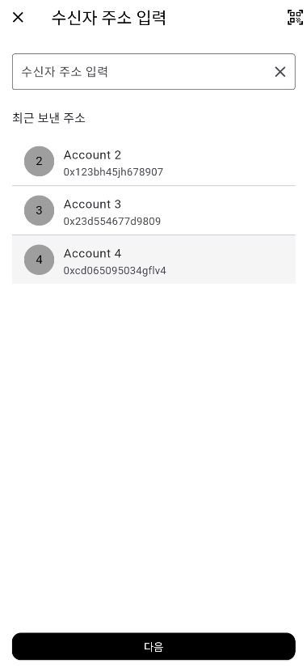
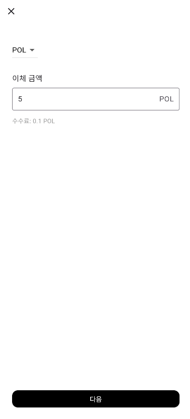

## 👛 Feature: Wallet 생성 및 복구

사용자가 여러 개의 지갑을 생성하고 복구하며, 각 지갑을 자유롭게 관리할 수 있습니다.

---

### 🧩 주요 기능 구성

#### 1. **니모닉 기반 지갑 생성**

- 지갑 이름 입력 → 자동 생성된 12단어 니모닉 표시 → 니모닉 확인
- 사용자가 생성된 니모닉을 안전하게 백업할 수 있도록 니모닉 확인 과정과 경고창을 추가했습니다.
- 마지막 단계에서 생성된 지갑의 이름과 주소를 확인할 수 있습니다

#### 2. **니모닉을 통한 지갑 복구**

- 기존에 보관 중인 니모닉 단어 12개를 입력하여 지갑 복구
- 복구 완료 시, 기존 지갑 주소가 지갑 목록에 추가됩니다

#### 3. **다중 지갑 관리 기능**

- 생성/복구된 지갑들은 리스트로 관리되며, 선택한 지갑이 기본 지갑으로 설정됩니다

---

## 💰 Feature: Wallet 잔액 및 트랜잭션 내역 조회

해당 기능은 사용자의 선택 지갑 주소를 기준으로 실시간 잔액과 최근 트랜잭션 내역을 조회하여 홈 화면에 표시합니다. 백엔드 서버 없이 Polygon Amoy 테스트넷의 API를 직접 호출하여 구현됩니다.

---

### 🧩 주요 기능 구성

#### 1. **지갑 잔액 실시간 조회**

- 선택된 지갑 주소의 잔액을 Polygon Amoy Testnet RPC를 통해 조회
- web3dart 라이브러리를 활용하여 getBalance() 호출
- USD 환율은 CoinGecko API를 통해 가져와 실시간 자산 가치를 함께 표시

#### 2. **트랜잭션 내역 조회 (백엔드 없이)**

- 선택된 지갑 주소의 트랜잭션 내역을 Polygonscan Amoy API로 조회
- 최근 5~10개의 트랜잭션을 리스트 형태로 표시 (전송/수신 구분, 상대 주소, 수량, 날짜 등)
- 수신/전송 여부는 from 필드를 기준으로 판단

---

## 🔁 Feature: Wallet Transaction

`feature/wallet-transaction` 브랜치에서는 Flutter 기반 지갑 앱에 **Polygon Testnet 송금 기능**을 구현했습니다. 사용자는 지갑 간 C2C 이체를 안전하고 직관적으로 실행할 수 있습니다.

---

### 📌 주요 기능 구성

#### 1. **QR 코드 기반 주소 송/수신**

- 내 지갑 주소를 QR로 생성하여 타인에게 공유
- 상대방의 QR 코드를 카메라로 스캔하여 주소 자동 입력

#### 2. **송금 흐름 (3단계)**

1. **수신자 선택**

   - 최근 보낸 주소 리스트 표시
   - QR 코드 스캔 or 직접 입력

2. **이체 금액 입력**

   - 지원 토큰(예: `POL`, `ETH`) 중 선택
   - 전송 수수료 표시

3. **송금 확인**
   - 수신 주소, 이체 토큰 및 수량, 수수료 요약
   - "보내기" 버튼 클릭 시 트랜잭션 실행

---

## 🖼️ UI 미리보기

### 1. **송수신**

<table align="center">
  <tr>
    <td align="center">
      <br/>
      <b>수신자 선택</b>
    </td>
    <td align="center">
      <br/>
      <b>이체 금액</b>
    </td>
  </tr>
   <tr>
    <td align="center">
      <br/>
      <b>전송 확인</b>
    </td>
    <td align="center">
      <br/>
      <b>QR 수신</b>
    </td>
  </tr>
</table>

### 2. **지갑 생성**

<table align="center">
  <tr>
    <td align="center">
      <br/>
      <b>홈 화면</b>
    </td>
    <td align="center">
      <br/>
      <b>지갑 목록 화면</b>
    </td>
   </tr>
   <tr>
    <td align="center">
      <br/>
      <b>니모닉 확인 화면</b>
    </td>
    <td align="center">
      <br/>
      <b>지갑 생성 완료 화면</b>
    </td>
  </tr>
</table>

### 3. **잔액/트랜잭션 내역 조회**

<table align="center">
  <tr>
    <td align="center">
      <br/>
      <b>잔액/트랜잭션 내역 조회</b>
    </td>
  </tr>
</table>

---

### 🧱 사용된 기술 스택

| 항목                 | 기술                                           |
| -------------------- | ---------------------------------------------- |
| 모바일 프레임워크    | Flutter                                        |
| 상태관리             | Provider (MVVM 패턴 적용)                      |
| 니모닉 생성          | `bip39`                                        |
| 영구 저장            | `flutter_secure_storage`, `shared_preferences` |
| QR 코드 생성/스캔    | `qr_flutter`, `mobile_scanner`                 |
| 블록체인 인터랙션    | `web3dart`, Polygon Amoy Testnet               |
| 트랜잭션 내역 조회   | `Polygonscan Amoy API`                         |
| 환율 정보 연동     | CoinGecko API                                  |
| 비동기 처리 | `async/await`, `FutureBuilder`, `setState`           |

---

### 🧪 테스트 환경

- **Polygon Amoy Testnet**
- `chainId`: `80002`
- Faucet 사용 후 테스트 토큰 전송, 수신, 조회 정상 작동 확인

---

### 📂 주요 디렉토리 구조

```bash
lib/
├── app
│   └── app.dart
├── assets
│   ├── ConfirmTransactionScreen.png
│   ├── HomeScreen.png
│   ├── InputAmountScreen.png
│   ├── ReceiveQrScreen.png
│   ├── SelectRecipient.png
│   └── WalletMainScreen.png
├── core
│   ├── config.dart
│   ├── constants.dart
│   └── utilities.dart
├── data
│   └── services
│       ├── secure_storage_service.dart
│       ├── transaction_service.dart
│       └── wallet_service.dart
├── main.dart
├── models
│   ├── rpc_service.dart
│   ├── transaction_model.dart
│   └── wallet_model.dart
├── presentation
│   └── screens
│       ├── create_wallet
│       ├── home_screen.dart
│       ├── qr
│       ├── receive
│       ├── send
│       ├── wallet_list_screen.dart
│       └── wallet_main_screen.dart
└── viewmodels
    ├── transaction_viewmodel.dart
    └── wallet_viewmodel.dart
```
