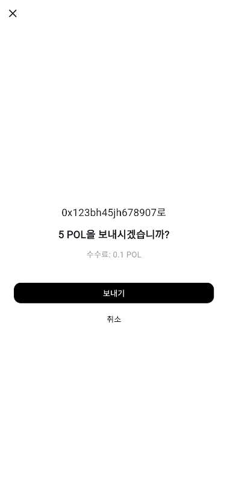

## 👛 Feature: Wallet 생성 및 복구

사용자가 여러 개의 지갑을 생성하고 복구하며, 각 지갑을 자유롭게 관리할 수 있습니다.

---

### 🧩 주요 기능 구성

#### 1. **니모닉 기반 지갑 생성**

- 지갑 이름 입력 → 자동 생성된 12단어 니모닉 표시 → 니모닉 확인
- 사용자가 생성된 니모닉을 안전하게 백업할 수 있도록 니모닉 확인 과정과 경고창을 추가했습니다.
- 마지막 단계에서 생성된 지갑의 이름과 주소를 확인할 수 있습니다

#### 2. **니모닉을 통한 지갑 복구**

- 기존에 보관 중인 니모닉 단어 12개를 입력하여 지갑 복구
- 복구 완료 시, 기존 지갑 주소가 지갑 목록에 추가됩니다

#### 3. **다중 지갑 관리 기능**

- 생성/복구된 지갑들은 리스트로 관리되며, 선택한 지갑이 기본 지갑으로 설정됩니다

---

## 🔁 Feature: Wallet Transaction

`feature/wallet-transaction` 브랜치에서는 Flutter 기반 지갑 앱에 **Polygon Testnet 송금 기능**을 구현했습니다. 사용자는 지갑 간 C2C 이체를 안전하고 직관적으로 실행할 수 있습니다.

---

### 📌 주요 기능 구성

#### 1. **QR 코드 기반 주소 송/수신**

- 내 지갑 주소를 QR로 생성하여 타인에게 공유
- 상대방의 QR 코드를 카메라로 스캔하여 주소 자동 입력

#### 2. **송금 흐름 (3단계)**

1. **수신자 선택**
   - 최근 보낸 주소 리스트 표시
   - QR 코드 스캔 or 직접 입력

2. **이체 금액 입력**
   - 지원 토큰(예: `POL`, `ETH`) 중 선택
   - 전송 수수료 표시

3. **송금 확인**
   - 수신 주소, 이체 토큰 및 수량, 수수료 요약
   - "보내기" 버튼 클릭 시 트랜잭션 실행

---

## 🖼️ UI 미리보기

<table align="center">
  <tr>
    <td align="center">
      <br/>
      <b>수신자 선택</b>
    </td>
    <td align="center">
      <br/>
      <b>이체 금액</b>
    </td>
    <td align="center">
      <br/>
      <b>전송 확인</b>
    </td>
    <td align="center">
      <br/>
      <b>QR 수신</b>
    </td>
  </tr>
</table>

<table align="center">
  <tr>
    <td align="center">
      <br/>
      <b>홈 화면</b>
    </td>
    <td align="center">
      <br/>
      <b>지갑 목록 화면</b>
    </td>
    <td align="center">
      <br/>
      <b>니모닉 확인 화면</b>
    </td>
    <td align="center">
      <br/>
      <b>지갑 생성 완료 화면</b>
    </td>
  </tr>
</table>

---

### 🧱 사용된 기술 스택

| 항목 | 기술 |
|------|------|
| 모바일 프레임워크 | Flutter |
| 상태관리 | Provider (MVVM 패턴 적용) |
| 니모닉 생성 | `bip39` |
| 영구 저장 | `flutter_secure_storage`, `shared_preferences` |
| QR 코드 생성/스캔 | `qr_flutter`, `mobile_scanner` |
| 블록체인 인터랙션 | `web3dart`, Polygon Amoy Testnet |
| 비동기 트랜잭션 처리 | `async/await` + `sendTransaction()` |

---

### 🧪 테스트 환경

- **Polygon Amoy Testnet**
- `chainId`: `80002`
- Faucet 사용 후 테스트 토큰 전송 완료

---

### 📂 주요 디렉토리 구조

```bash
lib/
├── core/
│   ├── constants.dart
│   └── utilities.dart
│
├── data/
│   └── services/
│       ├── secure_storage_service.dart
│       ├── transaction_service.dart
│       └── wallet_service.dart
│
├── models/
│   ├── rpc_service.dart
│   ├── transaction_model.dart
│   └── wallet_model.dart
│
├── presentation/
│   ├── qr/
│   │   └── qr_scan_screen.dart
│   ├── screens/
│   │   ├── send/
│   │   │   ├── select_recipient_screen.dart
│   │   │   ├── input_amount_screen.dart
│   │   │   └── confirm_transaction_screen.dart
│   │   ├── receive/
│   │   │   └── ... (추가 예정)
│   │   ├── home_screen.dart
│   │   ├── wallet_created_screen.dart
│   │   └── wallet_list_screen.dart
│
├── view/
│   └── wallet/
│       ├── wallet_mnemonic_screen.dart
│       ├── wallet_mnemonic_confirm_screen.dart
│       └── wallet_recovery_screen.dart
│
├── viewmodels/
│   ├── wallet_viewmodel.dart
│   └── transaction_viewmodel.dart
│
└── main.dart
